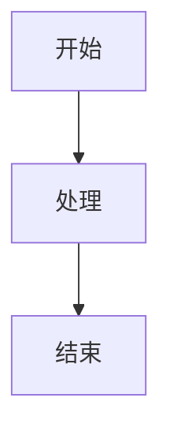
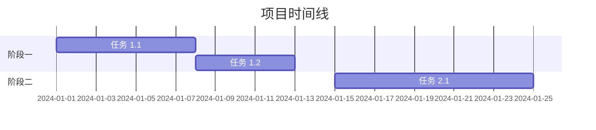

# 文档标题

> 简短描述或副标题

**元信息：**
- 创建日期：YYYY-MM-DD
- 最后更新：YYYY-MM-DD
- 版本：1.0.0
- 作者：[作者名]
- 状态：[草稿/审核中/已发布]

---

## 📋 目录

1. [概述](#概述)
2. [背景](#背景)
3. [目标](#目标)
4. [详细内容](#详细内容)
5. [实施步骤](#实施步骤)
6. [时间线](#时间线)
7. [资源需求](#资源需求)
8. [风险与挑战](#风险与挑战)
9. [附录](#附录)

---

## 概述

简要说明文档的核心内容和目的。

### 关键点

- 关键点 1
- 关键点 2
- 关键点 3

---

## 背景

描述项目/任务的背景信息、上下文和起因。

### 历史沿革

- 时间节点 1：事件描述
- 时间节点 2：事件描述

### 相关文档

- [链接到相关文档 1](./doc1.md)
- [链接到相关文档 2](./doc2.md)

---

## 目标

明确列出要达成的目标。

### 主要目标

1. **目标一**：具体描述
2. **目标二**：具体描述
3. **目标三**：具体描述

### 成功标准

| 指标 | 目标值 | 当前值 | 状态 |
|------|--------|--------|------|
| 指标 1 | 100% | 0% | ⏳ 待开始 |
| 指标 2 | 50 用户 | 0 用户 | ⏳ 待开始 |

---

## 详细内容

### 模块 A

#### 功能描述

详细说明模块 A 的功能。

#### 技术实现

```python
# 示例代码
def example_function():
    pass
```

### 模块 B

#### 功能描述

详细说明模块 B 的功能。

#### 流程图



---

## 实施步骤

### 阶段一：准备阶段

- [ ] 任务 1.1
- [ ] 任务 1.2
- [ ] 任务 1.3

### 阶段二：执行阶段

- [ ] 任务 2.1
- [ ] 任务 2.2
- [ ] 任务 2.3

### 阶段三：验收阶段

- [ ] 任务 3.1
- [ ] 任务 3.2

---

## 时间线



### 关键里程碑

| 日期 | 里程碑 | 交付物 |
|------|--------|--------|
| 2024-01-01 | 项目启动 | 项目计划书 |
| 2024-01-15 | 中期评审 | 进度报告 |
| 2024-02-01 | 项目完成 | 最终交付物 |

---

## 资源需求

### 人力资源

| 角色 | 人数 | 职责 |
|------|------|------|
| 项目经理 | 1 | 整体协调 |
| 开发工程师 | 2 | 功能开发 |
| 测试工程师 | 1 | 质量保障 |

### 技术资源

- 服务器：2 台
- 数据库：MySQL 8.0
- 开发工具：VS Code, Git

### 预算

| 项目 | 金额 | 备注 |
|------|------|------|
| 人力成本 | ¥50,000 | - |
| 服务器费用 | ¥5,000 | 年度 |
| 总计 | ¥55,000 | - |

---

## 风险与挑战

### 已识别风险

| 风险 | 可能性 | 影响 | 缓解措施 |
|------|--------|------|----------|
| 技术风险 | 中 | 高 | 提前技术预研 |
| 人员风险 | 低 | 中 | 建立备份机制 |

### 应对策略

1. **预防策略**：描述预防措施
2. **应急策略**：描述应急预案

---

## 附录

### A. 术语表

| 术语 | 定义 |
|------|------|
| API | 应用程序接口 |
| SDK | 软件开发工具包 |

### B. 参考资料

1. [参考链接 1](https://example.com)
2. [参考链接 2](https://example.com)

### C. 变更记录

| 版本 | 日期 | 变更内容 | 变更人 |
|------|------|----------|--------|
| 1.0.0 | 2024-01-01 | 初始版本 | 作者名 |
| 1.0.1 | 2024-01-05 | 更新目标章节 | 作者名 |

---

## 📧 邮件通知配置

本文档完成后，可通过以下配置发送邮件通知相关人员：

```bash
# 使用 email-sender skill 发送
python -m skills.email-sender \
  --to recipient@example.com \
  --subject "文档发布通知：文档标题" \
  --body "文档已发布，请查阅附件或链接" \
  --attachment "./docs/结构化文档模板.md"
```

---

*文档结束*
